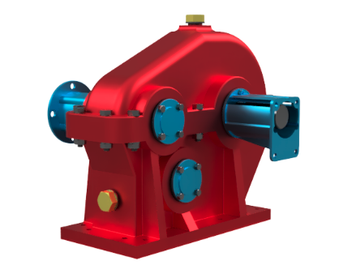
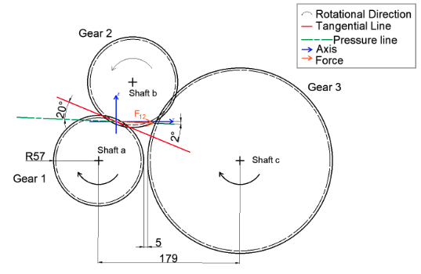

# Power Take-Off Gear Reduction Unit

This is a project required us to analyze and optimize the shaft design in a Power Take-Off Rear Reduction Unit, ensuring reliable power transmission from a diesel engine to a water pump.

This coursework entails mechanical design, stress analysis, and understanding of power transmission systems. 

The model of the gear reduction unit was designed in the Autodesk Fusion 360. 

